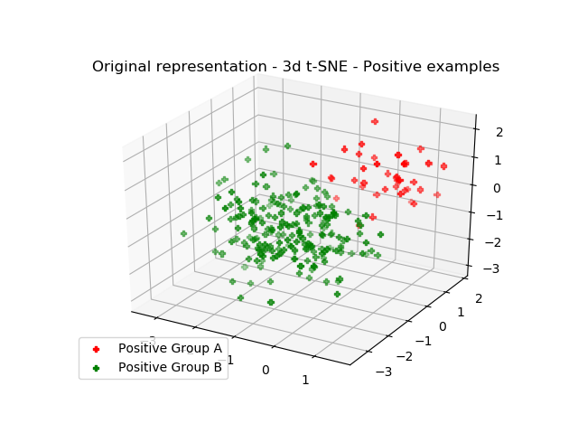
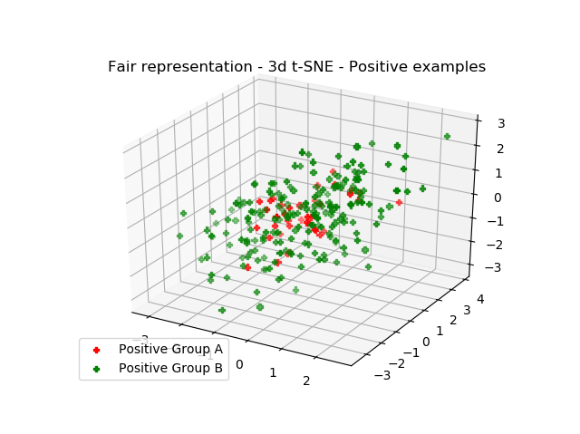

# Fair Empirical Risk Minimization (FERM)

Fair SVM with Equal Opportunity constraint.

An example of application is presented in the __main()__ method of both algorithms. Specifically, we applied the methods to Adult dataset 
(https://archive.ics.uci.edu/ml/datasets/adult) considering the gender as sensitive feature.

- __*Linear*__ case (linear_ferm.py)

Running the main method of this algorithm, you have the following output:
```
The dataset is loaded...
Different values of the sensible feature 9 : [-1.4413095629355945, 0.6938134774900437]
Grid search...
Best Estimator: SVC(C=0.1, cache_size=200, class_weight=None, coef0=0.0,
  decision_function_shape='ovr', degree=3, gamma='auto', kernel='linear',
  max_iter=-1, probability=False, random_state=None, shrinking=True,
  tol=0.001, verbose=False)
Accuracy test: 0.8083879630360951
Accuracy train: 0.8103252357114339
DEO test: 0.10901912244853612
DEO train: 0.10884903768735288

Grid search for our method...
Best Fair Estimator:: SVC(C=0.01, cache_size=200, class_weight=None, coef0=0.0,
  decision_function_shape='ovr', degree=3, gamma='auto', kernel='linear',
  max_iter=-1, probability=False, random_state=None, shrinking=True,
  tol=0.001, verbose=False)
Accuracy test fair: 0.7956717478872127
Accuracy train fair: 0.7979484659562053
DEO test: 0.03310957683705801
DEO train: 0.009642964975845436
```
- __*Non linear*__ case (ferm.py)

Running the main method of this algorithm, you have the following output:
```
A smaller version of the dataset is loaded...
Different values of the sensible feature 9 : [-1.4413095629355945, 0.6938134774900437]
Grid search for SVM...
Best Estimator: SVC(C=10.0, cache_size=200, class_weight=None, coef0=0.0,
  decision_function_shape='ovr', degree=3, gamma=0.01, kernel='rbf',
  max_iter=-1, probability=False, random_state=None, shrinking=True,
  tol=0.001, verbose=False)
Accuracy test: 0.832240739278098
Accuracy train: 0.8329238329238329
DEO test: 0.22031819509710115
DEO train: 0.18403298350824593

Grid search for our method...
Best Fair Estimator: FERM(C=1, gamma=0.1, kernel='rbf', sensible_feature=9)
Accuracy test: 0.8315298949530053
Accuracy train: 0.8734643734643734
DEO test: 0.12431885180001784
DEO train: 0.07821089455272356
```


The other files in the package contain utilities as:

- Fairness measures (measures.py)
- Loading datasets (load_data.py)
- Generating an unfair toy problem (toy_data.py)
- Using t-SNE to check fairness of the induced new linear representations (linear_representation_tSNE.py)


# Linear Fair Representation
Running the script ``linear_representation_tSNE.py``, it is possible to see how, in a simple toy problem generated by using ``toy_data.py``, the fair linear representation induced by Linear FERM acts on the examples of two different sensitive groups.

Once the data is loaded, we simply run the following code:
```
    # We do not need to fit a model -> model=None
    algorithm = Linear_FERM(dataset=dataset_train, model=None, sensible_feature=sensible_feature)
    # Linear fair representation
    new_dataset_train = algorithm.new_representation(dataset_train.data)
    print('New fair representation done!')
```

We show here the 3D t-SNE plot of the two representation:




It is easy to note that, when the fair representation is applied, the two groups are indistinguishable.


#How to cite

The idea of this code is from the following paper:

*Michele Donini, Luca Oneto, Shai Ben-David, John Shawe-Taylor, and Massimiliano Pontil. 
"[__Empirical Risk Minimization under Fairness Constraints.__](https://arxiv.org/pdf/1802.08626.pdf)" 
arXiv preprint arXiv:1802.08626 (2018).* __[ACCEPTED @ NIPS 2018]__

Bibtex citation:
```
@inproceedings{donini2018empirical,
  title={Empirical risk minimization under fairness constraints},
  author={Donini, Michele and Oneto, Luca and Ben-David, Shai and Shawe-Taylor, John S and Pontil, Massimiliano},
  booktitle={Advances in Neural Information Processing Systems},
  pages={2791--2801},
  year={2018}
}
```

Michele Donini.

